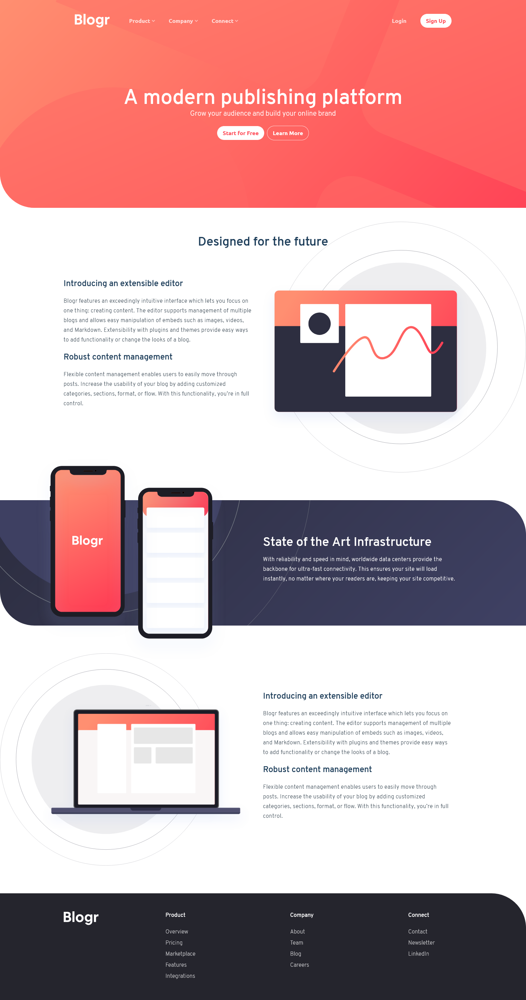

# Frontend Mentor - Blogr landing page solution

This is a solution to the [Blogr landing page challenge on Frontend Mentor](https://www.frontendmentor.io/challenges/blogr-landing-page-EX2RLAApP). Frontend Mentor challenges help you improve your coding skills by building realistic projects.

## Table of contents

- [Frontend Mentor - Blogr landing page solution](#frontend-mentor---blogr-landing-page-solution)
  - [Table of contents](#table-of-contents)
  - [Overview](#overview)
    - [The challenge](#the-challenge)
    - [Links](#links)
    - [Screenshot](#screenshot)
  - [My process](#my-process)
    - [Built with](#built-with)
  - [Author](#author)

## Overview

### The challenge

Users should be able to:

- View the optimal layout for the site depending on their device's screen size
- See hover states for all interactive elements on the page

### Links

- Solution URL: [https://www.frontendmentor.io/solutions/blogr-landing-page-with-reacttailwindcss-jGrtCJnq3](https://www.frontendmentor.io/solutions/blogr-landing-page-with-reacttailwindcss-jGrtCJnq3)
- Live Site URL: [https://blogr-landing-page-ckeller22.vercel.app/](https://blogr-landing-page-ckeller22.vercel.app/)

### Screenshot

## My process

### Built with

- [Tailwind](https://tailwindcss.com/) - CSS Framework
- [React](https://reactjs.org/) - JS library

## Author

- Website - [chriskeller.xyz](http://www.chriskeller.xyz)
- Frontend Mentor - [@ckeller22](https://www.frontendmentor.io/profile/ckeller22)
- Twitter - [@the_chrus](https://www.twitter.com/the_chrus)
